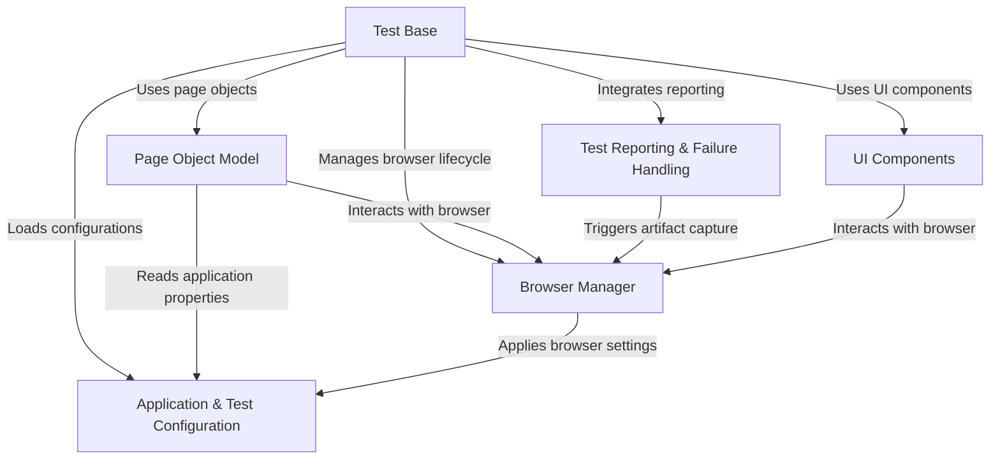
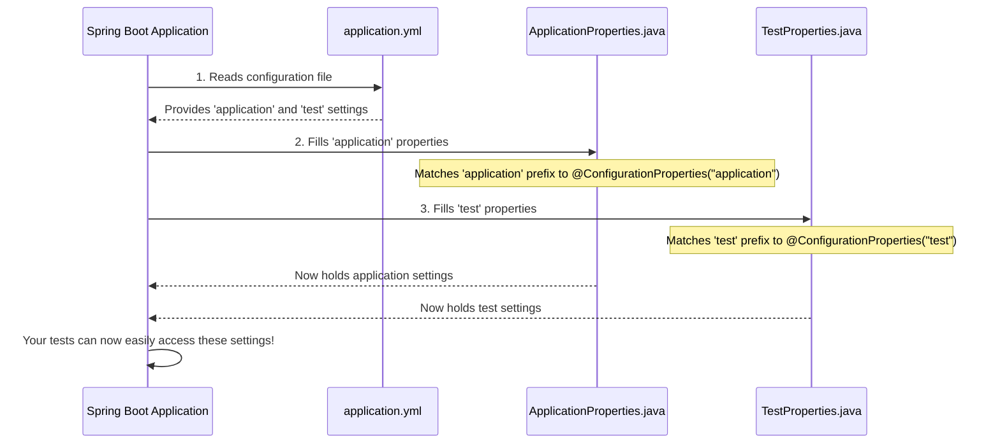
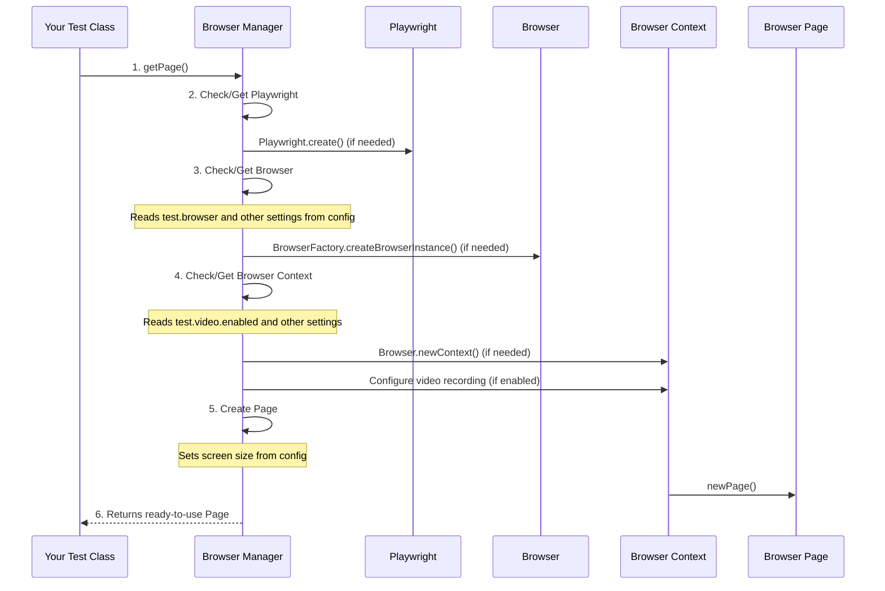
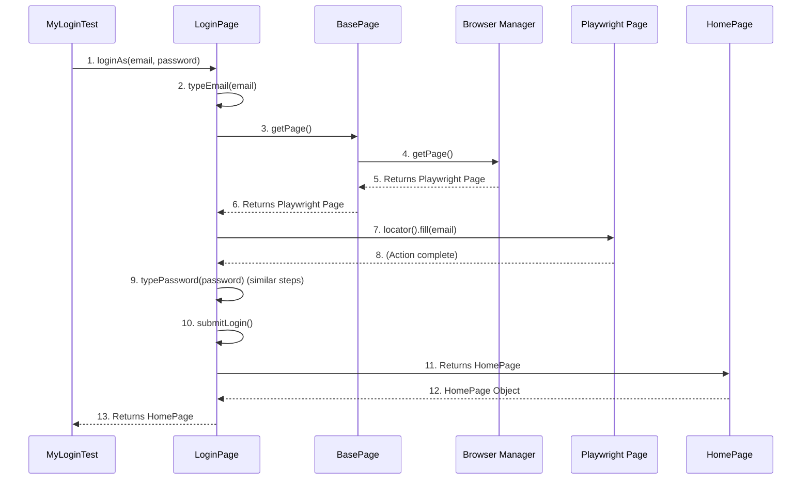
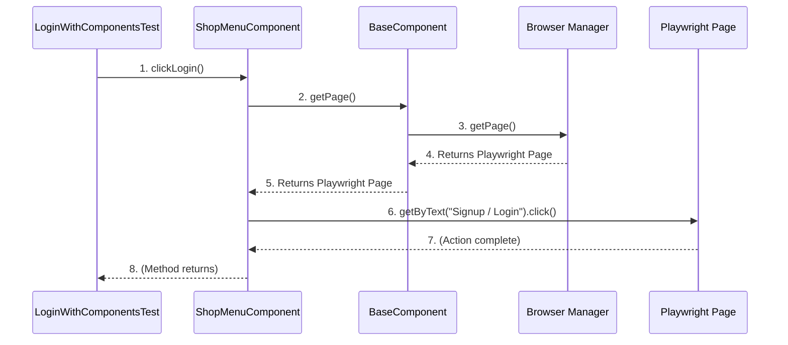
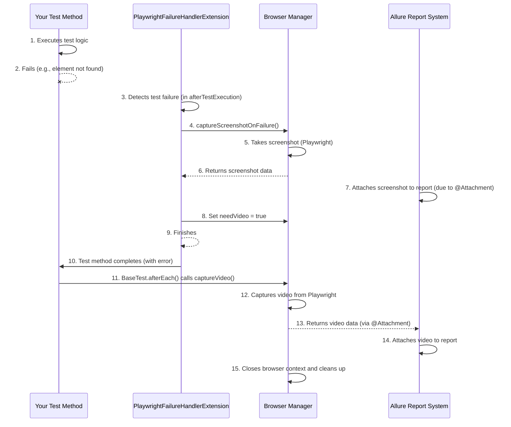
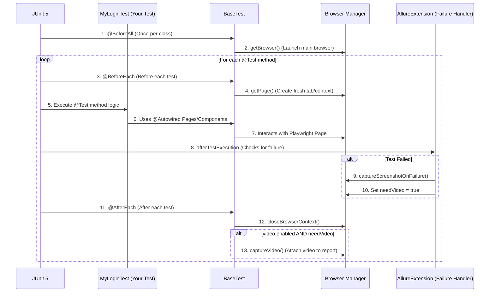

# Test Automation Framework - UI Automation with Playwright, Spring Boot and JUnit 5

## Overview

This UI Test Automation Framework is designed **to automate end-to-end UI testing of web applications**.
The framework leverages **Playwright** for browser automation, **JUnit 5** for test structuring and execution,
and **Gradle** as the build tool. **Spring Boot** is used for **Dependency Injection (DI) and
Configuration Management**.
**Log4j2** handles logging, and **Allure** is used to generate rich test reports.

Additionally, this framework supports parallel test execution, the ability to capture screenshots and videos during test
execution,
and integrates configuration from an `application.yml` file to set up environment-specific settings, such as browser
type and timeout.

## Key Features

- **Playwright Integration:** Automates UI testing across various browsers (Chromium, Firefox, and WebKit),
  simulating real user interactions like clicks, form submissions, and validation.
- **JUnit 5:** Organizes tests and provides advanced features such as parallel test execution, flexible assertions,
  and lifecycle management.
- **Parallel Execution:** The framework supports parallel execution of tests, improving test suite execution times.
  You can configure the number of concurrent threads and control execution modes for classes and tests.
- **Spring Boot Integration:** Leverages Spring Boot for managing dependencies and application configuration
  via @Configuration and @ConfigurationProperties annotations, which makes the setup process highly configurable and
  flexible.
- **Log4j2 for Logging:** Provides detailed logging to track test steps and errors. Configured via Log4j2’s XML
  configuration.
- **Allure Reporting:** Generates detailed, visually appealing test reports that include test status (pass/fail),
  execution times, logs, screenshots, and videos.
- **Video and Screenshots:** Capture videos and screenshots during test execution for easier debugging and issue
  tracking.
  These are automatically attached to the Allure reports.
- **JUnit 5 Configuration:** Supports configuration for parallel test execution, which helps improve test performance
  by running tests concurrently.

## Technologies Used

Given test automation project is built with next key frameworks and technologies:

- [Java 21](https://openjdk.org/projects/jdk/21/) as the programming language.
- [Gradle 8.12.1](https://gradle.org/) build tool for managing dependencies and running the test suite.
- [Spring Boot](https://spring.io/projects/spring-boot) for bean lifecycle management, dependency injection and
  configuration properties;
- [Playwright](https://playwright.dev/) a Node.js library that enables reliable browser automation.
  Supports Chromium, Firefox, and WebKit.
- [Log4j2](https://logging.apache.org/log4j/) a powerful logging library to manage logs from your automated tests.
- [Project Lombok](https://projectlombok.org/) is a Java library that reduces boilerplate code by generating getters,
  setters, constructors, and other common methods through annotations.
- [JUnit 5](https://junit.org/junit5/) a modern testing framework that supports features such as parallel test
  execution,
  flexible assertions, and annotations.
- [Allure](https://docs.qameta.io/allure/) a framework for generating beautiful and comprehensive test reports,
  including details like screenshots,
  videos, and execution times.

## Getting Started

### Prerequisites

- JDK 21 or higher.
- Gradle for build and dependency management.
- Playwright is included as a Gradle dependency and will be installed automatically during the build process

### Installation

1. [Fork](https://github.com/alex-sviatenko/playwright-java-springboot-test/fork) the repository.
2. Clone the repository and navigate to the project

```
$ git clone https://github.com/[your_username]/playwright-java-springboot-test.git
$ cd playwright-java-springboot-test
```

3. Create environment variables for your testing credentials.

To keep sensitive data (such as login credentials) secure and separate from your codebase, the test framework uses
**environment variables** for configuration. Specifically, the `email` and `password` required for logging into
[Automation Exercise](https://www.automationexercise.com/) are retrieved from environment variables.

For Linux/macOS:

```bash
  export TEST_EMAIL=your-temp-email@example.com
  export TEST_PASSWORD=your-temp-password
```

For Windows:

```bash
  set TEST_EMAIL=your-temp-email@example.com
  set TEST_PASSWORD=your-temp-password
```

4. Configure the test properties:

The `application.yml` will reference these environment variables. The email and password will be read at runtime.

**Example `application.yml`**:

```yaml
  test:
    email: ${TEST_EMAIL}
    password: ${TEST_PASSWORD}
```

5. Build the project and run tests using Gradle:

```shell
./gradlew test
```

Overriding YAML properties via Command Line in Spring Boot

```shell
./gradlew test -Dtest.browser=firefox -Dtest.headless=true
```

6. Generate Allure Reports:

```shell
./gradlew allureServe
```

## Parallel Test Execution with JUnit 5

The framework is configured to run tests in parallel to speed up execution.
The following settings are applied in the `junit-platform.properties` file:

- **Parallel Execution Enabled:** Tests are executed in parallel to improve speed.
- **Test Execution Configuration:**
    - **same_thread:** Ensures tests run on the same thread by default.
    - **concurrent:** Runs classes concurrently.
    - **fixed:** A fixed parallelism strategy is used with 2 threads running tests concurrently.

You can modify these properties in the `junit-platform.properties` file to adjust the parallel execution as needed.

```properties
junit.jupiter.execution.parallel.enabled=true
junit.jupiter.execution.parallel.mode.default=same_thread
junit.jupiter.execution.parallel.mode.classes.default=concurrent
junit.jupiter.execution.parallel.config.strategy=fixed
junit.jupiter.execution.parallel.config.fixed.parallelism=2
```

## Allure Reporting

Allure is used for generating comprehensive and visually appealing test reports. It displays test results,
execution times, logs, and attachments such as screenshots and videos.
To configure Allure reporting, follow these steps:

1. Allure Properties: Set the directory where Allure should store the test results by adding the following to the
   `allure.properties` file:

```properties
allure.results.directory=build/allure-results
```

2. Test Attachments (Screenshots and Videos):

- The framework is set to capture screenshots and record videos during test execution.
- Videos are stored in the directory specified in your `application.yml` configuration, under **test.video.path**.
- Allure automatically attaches the screenshots and videos to the report when test is failed.

3. Generate the Allure Report:

- After running your tests, you can view the Allure report with:

```shell
./gradlew allureServe
```

## Application Configuration

The test framework can be customized through the `application.yml` file.
Here you can define settings related to the test environment, such as the base URL, email,
password, browser settings, and video capture configurations.
It provides an organized way to configure test properties that are injected into the test classes.

- The ***@Configuration*** annotation allows you to create configuration classes that bind values from the
  `application.yml` file to fields in the class.
- The ***@ConfigurationProperties*** annotation is used to map the configuration values automatically to the fields in
  the class.

### Example Configuration (application.yml): ###

```yaml
application:
  url: https://www.automationexercise.com/
  email: ${TEST_EMAIL}
  password: ${TEST_PASSWORD}

test:
  browser: chromium
  headless: true
  slow:
    motion: 100
  timeout: 10000
  video:
    enabled: true
    path: build/test-video/
    size:
      width: 1280
      height: 720
  screen:
    size:
      width: 1920
      height: 1080
```

- **browser:** Specifies which browser to use (e.g., chromium, firefox, webkit).

- # Tutorial: playwright-java-springboot-test

This project provides a robust framework for **automated UI testing** using Playwright and Spring Boot. It allows testers to write **clean, maintainable tests** by structuring web pages and reusable elements into objects (*Page Object Model* and *UI Components*). The framework efficiently *manages browser setup* and teardown, *handles configurations* for both the application and tests, and includes advanced *reporting features* like automatic screenshots and video recordings on test failures, ensuring clear diagnostics.


## Visual Overview



## Chapters

1. [Application & Test Configuration
](01_application___test_configuration_.md)
2. [Browser Manager
](02_browser_manager_.md)
3. [Page Object Model
](03_page_object_model_.md)
4. [UI Components
](04_ui_components_.md)
5. [Test Reporting & Failure Handling
](05_test_reporting___failure_handling_.md)
6. [Test Base
](06_test_base_.md)

# Chapter 1: Application & Test Configuration

Imagine you're building a robot that needs to test a website. Sometimes, the website address changes. Sometimes, you want the robot to use a different browser, like Chrome instead of Firefox. Or maybe you want it to record a video of its testing actions!

If you had to change the robot's "brain" (its code) every single time one of these settings changed, it would be a lot of work! This is where **Application & Test Configuration** comes to the rescue.

Think of it like the "settings menu" on your phone or a video game. You can change things like Wi-Fi, screen brightness, or game difficulty without needing to reprogram your phone or rewrite the game's code. Our test framework has a similar "settings menu" for our tests and the application we're testing.

### What Problem Does It Solve?

The main goal of this configuration system is to make your tests **flexible** and **easy to manage**.
Let's say you want to:
1.  Test a different website URL.
2.  Run your tests on Chrome instead of Edge.
3.  Have the browser window hidden (headless mode) when running tests on a server.
4.  Record a video of your test run.

Without a configuration system, you'd have to dig into your Java code, find the right lines, and change them every time. With configuration, you just change a simple settings file, and your tests automatically adapt!

### How Our "Settings Menu" Works

Our system uses a combination of two main things:

1.  **YAML Files:** These are simple, human-readable text files that hold all our settings. They look a bit like an organized list or outline.
2.  **Java Classes:** Special Java code that knows how to read these YAML files and turn the settings into usable objects within our tests.

Let's look at how we define our settings.

#### Step 1: Defining Settings in `application.yml`

All our global settings are stored in a file named `application.yml`. You can find it in `src/main/resources/application.yml`.

Here's a simplified look at what's inside:

```yaml
# src/main/resources/application.yml

application:
  url: https://www.automationexercise.com/ # The website we want to test
  email: ${TEST_EMAIL} # Login email (can come from a secret source)
  password: ${TEST_PASSWORD} # Login password (can come from a secret source)

test:
  browser: chromium # Which browser to use (e.g., chromium, firefox, webkit)
  headless: false # Run browser without showing its window (good for servers)
  slow:
    motion: 100 # How slow actions are, in milliseconds (100ms)
  timeout: 10000 # How long to wait for things, in milliseconds (10 seconds)
  video:
    enabled: true # Should we record a video of the test?
    path: build/test-video/ # Where to save the video
    # ... and other video/screen settings
```

**What's happening here?**

*   We have two main sections: `application:` and `test:`.
*   Under `application:`, we define settings related to the website we're testing, like its `url` and login `email`/`password`.
*   Under `test:`, we define settings for how our tests should run, like which `browser` to use (`chromium` is Chrome), if it should be `headless` (run in the background without a visible window), and settings for `video` recording.
*   Notice `${TEST_EMAIL}` and `${TEST_PASSWORD}`. This is a smart way to keep sensitive information (like login details) out of the main file. Instead, these values are loaded from "environment variables" which are like secret sticky notes attached to your computer, keeping your secrets safe!

#### Step 2: How Java Reads These Settings

Our Java code uses special classes to "map" these YAML settings into Java objects. This mapping is done automatically by Spring Boot (the framework our project uses).

Let's see the magic behind the scenes:



**Explanation of the sequence:**

1.  When our test application starts, the **Spring Boot Application** first looks for `application.yml`.
2.  It reads all the settings defined in `application.yml`.
3.  Then, it finds special Java classes (`ApplicationProperties.java` and `TestProperties.java`) that are marked to handle these settings.
4.  It automatically takes the values from `application.yml` and puts them into the correct fields within these Java objects.
5.  Now, any part of our test code can ask for `ApplicationProperties` or `TestProperties` objects and instantly get all the settings defined in the YAML file!

#### Diving into the Java Code

Let's look at the Java classes that make this connection:

**1. `ApplicationProperties.java`**
This class is designed to read the `application:` section of your `application.yml`.

```java
// src/main/java/com/configuration/ApplicationProperties.java
package com.configuration;

import lombok.Data; // Makes our class simpler (adds getters/setters)
import org.springframework.boot.context.properties.ConfigurationProperties;
import org.springframework.context.annotation.Configuration;

@Data // A shortcut to automatically create common methods like getUrl(), setUrl()
@Configuration // Tells Spring that this class contains configuration
@ConfigurationProperties(prefix = "application") // Connects to the 'application:' section in YAML
public class ApplicationProperties {
    private String url; // Will get the value of application.url
    private String email; // Will get the value of application.email
    private String password; // Will get the value of application.password
}
```

*   The `@ConfigurationProperties(prefix = "application")` annotation is the key! It tells Spring Boot: "Hey, fill the fields in this class with values from the `application:` section of the YAML file."
*   `url`, `email`, and `password` are Java variables that directly match `application.url`, `application.email`, and `application.password` from the YAML file.

**2. `TestProperties.java`**
Similarly, this class handles the `test:` section, including all its nested settings.

```java
// src/main/java/com/configuration/TestProperties.java
package com.configuration;

import lombok.Data;
import org.springframework.boot.context.properties.ConfigurationProperties;
import org.springframework.context.annotation.Configuration;

@Data
@Configuration
@ConfigurationProperties(prefix = "test") // Connects to the 'test:' section in YAML
public class TestProperties {

    private String browser; // Maps to test.browser
    private boolean headless; // Maps to test.headless
    private int timeout; // Maps to test.timeout
    private Slow slow = new Slow(); // Handles the nested 'slow' settings
    private Video video = new Video(); // Handles the nested 'video' settings
    private Screen screen = new Screen(); // Handles the nested 'screen' settings

    @Data
    public static class Slow {
        private int motion; // Maps to test.slow.motion
    }

    // ... (other nested classes for Video and Screen are similar)
    // For example, Video has its own nested 'Size' class
}
```

*   Notice how `TestProperties` has `Slow`, `Video`, and `Screen` as smaller, nested classes. This is how we represent the structured (indented) nature of the YAML file (e.g., `test.video.enabled` maps to `testProperties.getVideo().isEnabled()`). It keeps our settings organized!

**3. `TestConfiguration.java`**
This small class acts like a director, telling Spring Boot where to find all these configuration pieces.

```java
// src/main/java/com/configuration/TestConfiguration.java
package com.configuration;

import org.springframework.boot.context.properties.ConfigurationPropertiesScan;
import org.springframework.context.annotation.ComponentScan;
import org.springframework.context.annotation.Configuration;

@Configuration // Marks this class as a source of important configurations
@ConfigurationPropertiesScan // Tells Spring to look for classes with @ConfigurationProperties
@ComponentScan(basePackages = "com") // Tells Spring to scan the 'com' package for components
public class TestConfiguration {
    // This class mostly tells Spring how to set things up automatically.
    // We don't write much code here, but it's crucial for the magic to happen!
}
```

This class simply tells Spring Boot: "Look in the `com` package for any classes marked with `@ConfigurationProperties` and load them up!" This is how `ApplicationProperties` and `TestProperties` are found and used automatically.

### Why Is This Important?

*   **Easy Changes:** You can change the browser, URL, or video settings by just editing the `application.yml` file, without touching any Java code. This is super helpful when you need to run tests in different environments (e.g., development, staging, production) or with different browser settings.
*   **Cleaner Code:** Your test code doesn't get cluttered with hardcoded URLs or browser names. It simply asks for the `ApplicationProperties` or `TestProperties` object, and all the settings are there.
*   **Teamwork:** Different team members can easily understand and modify test settings without deep Java knowledge.

### Conclusion

In this chapter, we learned that "Application & Test Configuration" is like the control panel for our tests. It allows us to define all important settings, like the website URL, login details, and browser choices, in easy-to-read YAML files. Spring Boot then automatically loads these settings into Java objects, making our tests incredibly flexible and adaptable.

Now that we know how to configure our tests, the next step is to understand how we actually *control* the web browser to perform those tests. This is where the [Browser Manager](02_browser_manager_.md) comes in!

---

<sub><sup>Generated by [AI Codebase Knowledge Builder](https://github.com/The-Pocket/Tutorial-Codebase-Knowledge).</sup></sub> <sub><sup>**References**: [[1]](https://github.com/iammsnaveen/playwright-java-springboot-test/blob/0a8d0e29a4e3ee4e4249ab0b8df739e5b854f953/src/main/java/com/configuration/ApplicationProperties.java), [[2]](https://github.com/iammsnaveen/playwright-java-springboot-test/blob/0a8d0e29a4e3ee4e4249ab0b8df739e5b854f953/src/main/java/com/configuration/TestConfiguration.java), [[3]](https://github.com/iammsnaveen/playwright-java-springboot-test/blob/0a8d0e29a4e3ee4e4249ab0b8df739e5b854f953/src/main/java/com/configuration/TestProperties.java), [[4]](https://github.com/iammsnaveen/playwright-java-springboot-test/blob/0a8d0e29a4e3ee4e4249ab0b8df739e5b854f953/src/main/resources/application.yml)</sup></sub>

# Chapter 2: Browser Manager

In [Chapter 1: Application & Test Configuration](01_application___test_configuration_.md), we learned how to set up our tests by defining all the important details like the website's URL, which browser to use, and whether to record a video, all in easy-to-change settings files. Now that we've told our testing robot *what* settings to use, the next logical step is to tell it *how* to actually open and control a web browser using those settings.

Imagine the **Browser Manager** as the "control room" for your web browser. It's the central hub that takes all those settings from [Application & Test Configuration](01_application___test_configuration_.md) and uses them to launch a browser, open tabs, and prepare everything needed for your tests to interact with a website.

### What Problem Does It Solve?

Let's say you want to write a test that needs to:
1.  Open a web browser (like Chrome, Firefox, or Safari).
2.  Go to a specific website.
3.  Ensure the browser window is a certain size.
4.  Maybe even record a video of the test run, as specified in our configuration!

Without a Browser Manager, every single test you write would need to include repetitive code to:
*   Start Playwright (the library that controls browsers).
*   Choose and launch the correct browser (e.g., Chromium).
*   Apply settings like `headless` (browser runs in the background) or `slowMo` (slow down actions).
*   Create a new isolated browsing session.
*   Open a new browser tab (which Playwright calls a "Page").

This would make your tests messy, hard to read, and difficult to update if you ever decided to change a browser setting. The **Browser Manager** solves this by centralizing all browser setup logic. Your tests simply *ask* the Browser Manager for a ready-to-use "Page" (a browser tab), and it handles all the complex details behind the scenes.

### Key Concepts: The Building Blocks of Browser Control

The Playwright library, which our Browser Manager uses, organizes browser interactions into a few key concepts:

| Concept         | Analogy                                  | What it is in Playwright                           |
| :-------------- | :--------------------------------------- | :------------------------------------------------- |
| **Playwright**  | The Grand Architect                      | The main library entry point. You start here to talk to *any* browser. |
| **Browser**     | The Car (Chromium, Firefox, WebKit)      | An actual instance of a web browser (e.g., Chrome). |
| **BrowserContext** | A Fresh Driver or Session             | An isolated browsing session within a browser. Like opening an Incognito window, it has no cookies or history from other sessions. Perfect for keeping tests independent! |
| **Page**        | A Single Tab                             | A single browser tab or window where your test interacts with a website. This is what your tests use most often! |

The Browser Manager orchestrates these pieces, putting them together in the right order with the right settings to give your test a fully prepared `Page`.

### How to Use the Browser Manager in Your Tests

When you write a test, you don't directly worry about launching Playwright or setting up browsers. You just need to tell Spring Boot that your test needs the `BrowserManager`, and then ask the `BrowserManager` for a `Page`.

Here's how a test might look (simplified):

```java
// Inside your test class (e.g., a test for a login page)
import com.browser.BrowserManager;
import com.microsoft.playwright.Page;
import org.springframework.beans.factory.annotation.Autowired;
import org.springframework.boot.test.context.SpringBootTest;

@SpringBootTest // Tells Spring Boot to load our application's configuration
class MyLoginTest {

    @Autowired // Spring Boot will automatically provide the BrowserManager here
    private BrowserManager browserManager;

    // This method runs before each test
    void setupBrowser() {
        // We don't call browserManager.getBrowser() or getPlaywright() directly.
        // We simply ask for a Page. The manager handles everything else!
        Page page = browserManager.getPage();

        // Now 'page' is ready to use, configured with settings from Chapter 1
        // Example: Go to our application's URL
        page.navigate("https://www.automationexercise.com/"); // (URL comes from config)
        // ... now you can interact with elements on the page ...
    }
}
```

**Explanation:**
1.  `@SpringBootTest` tells Spring to load our application, including all the configurations we set up in [Chapter 1: Application & Test Configuration](01_application___test_configuration_.md).
2.  `@Autowired private BrowserManager browserManager;` is Spring's way of saying: "Please give me an instance of the `BrowserManager` class." Spring automatically finds and provides it.
3.  When you call `browserManager.getPage()`, the Browser Manager performs all the necessary steps (launching Playwright, the browser, creating a context) and returns a fully configured `Page` object. This `Page` is your window to the website!

### What Happens Under the Hood? (Internal Implementation)

Let's trace what happens when your test calls `browserManager.getPage()`.

#### Step-by-Step Walkthrough

1.  **Your Test Requests a Page:** Your test calls `browserManager.getPage()`.
2.  **Playwright Check:** The Browser Manager first checks if Playwright itself (the main library) is already started. If not, it starts Playwright.
3.  **Browser Launch Check:** Next, it checks if a web browser (like Chromium) is already launched.
    *   If not, it reads the `test.browser` setting from our `application.yml` (from [Chapter 1: Application & Test Configuration](01_application___test_configuration_.md)).
    *   It then uses a helper called `BrowserFactory` to launch the *correct* browser (Chromium, Firefox, or WebKit) with the specified settings (e.g., `headless: true`, `slow.motion: 100`).
4.  **Browser Context Check:** After the browser is running, the Browser Manager checks if a `BrowserContext` (an isolated session) has been created.
    *   If not, it creates a new context.
    *   It also checks the `test.video.enabled` setting. If video recording is enabled, it configures the context to record video to the path specified in `application.yml`.
5.  **Page Creation & Setup:** Finally, it creates a new `Page` (a new tab) within that context. It sets the `viewportSize` (screen dimensions) based on your `test.screen.size` configuration.
6.  **Page Returned:** The fully prepared `Page` is then returned to your test, ready for interaction!

Here's a simplified sequence of events:



#### Diving into the Code

Let's look at the actual code that makes this happen in `BrowserManager.java`.

**1. `BrowserManager.java` - The Orchestrator**
This class holds the main logic for managing Playwright, browsers, contexts, and pages. Notice the `ThreadLocal` variables – these are crucial for ensuring that if you run multiple tests at the same time, each test gets its *own* separate browser instance, preventing conflicts.

```java
// src/main/java/com/browser/BrowserManager.java
package com.browser;

// ... other imports ...

import com.configuration.TestProperties; // Our configuration from Chapter 1

@Component // Marks this as a reusable component for Spring Boot
public class BrowserManager {

    // These store browser components unique to each test thread
    private final ThreadLocal<Playwright> playwrightThreadLocal = new ThreadLocal<>();
    private final ThreadLocal<Browser> browserThreadLocal = new ThreadLocal<>();
    private final ThreadLocal<BrowserContext> browserContextThreadLocal = new ThreadLocal<>();
    private final ThreadLocal<Page> pageThreadLocal = new ThreadLocal<>();

    private final BrowserFactory browserFactory; // Helper to create different browser types
    private final TestProperties testProperties; // Our configuration!

    // Spring Boot automatically gives us BrowserFactory and TestProperties
    public BrowserManager(BrowserFactory browserFactory, TestProperties testProperties) {
        this.browserFactory = browserFactory;
        this.testProperties = testProperties;
    }

    // Gets or creates the Playwright instance for the current test
    public Playwright getPlaywright() {
        if (playwrightThreadLocal.get() == null) {
            playwrightThreadLocal.set(Playwright.create()); // Create Playwright if not exists
        }
        return playwrightThreadLocal.get();
    }

    // Gets or creates the Browser instance (e.g., Chromium)
    public Browser getBrowser() {
        if (browserThreadLocal.get() == null) {
            // Use BrowserFactory to create the browser based on our config
            BrowserTypes browserType = BrowserTypes.valueOf(testProperties.getBrowser().toUpperCase());
            browserThreadLocal.set(browserFactory.createBrowserInstance(browserType,
                    getPlaywright(), // Uses the Playwright instance we just got
                    testProperties)); // Passes our configuration
        }
        return browserThreadLocal.get();
    }
    // ... more methods for getBrowserContext(), getPage(), etc.
}
```

**Explanation:**
*   The `BrowserManager` is marked `@Component`, telling Spring Boot it's a piece of our application it can manage.
*   It uses `BrowserFactory` (another component) and `TestProperties` (our configuration from [Chapter 1: Application & Test Configuration](01_application___test_configuration_.md)). Spring automatically "injects" these when `BrowserManager` is created.
*   `getPlaywright()` and `getBrowser()` methods check if an instance already exists for the current test. If not, they create one using our `TestProperties` to decide which browser and how to launch it.

**2. `BrowserManager.java` - Creating Context and Page**

```java
// src/main/java/com/browser/BrowserManager.java (continued)

// ... previous code ...

    // Gets or creates the BrowserContext (isolated session)
    public BrowserContext getBrowserContext() {
        if (browserContextThreadLocal.get() == null) {
            if (testProperties.getVideo().isEnabled()) {
                // If video recording is enabled in config, set it up
                BrowserContext browserContext = getBrowser()
                        .newContext(new Browser.NewContextOptions()
                                .setRecordVideoDir(Paths.get(testProperties.getVideo().getPath()))
                                .setRecordVideoSize(testProperties.getVideo().getSize().getWidth(),
                                        testProperties.getVideo().getSize().getHeight())
                        );
                browserContextThreadLocal.set(browserContext);
            } else {
                // Otherwise, just create a regular context
                browserContextThreadLocal.set(getBrowser().newContext());
            }
        }
        return browserContextThreadLocal.get();
    }

    // Gets or creates the Page (browser tab)
    public Page getPage() {
        if (pageThreadLocal.get() == null) {
            Page page = getBrowserContext().newPage(); // Create new page in our context
            // Set the screen size from our configuration
            page.setViewportSize(testProperties.getScreen().getSize().getWidth(),
                    testProperties.getScreen().getSize().getHeight());
            pageThreadLocal.set(page);
        }
        return pageThreadLocal.get();
    }

    // ... methods for capturing screenshots and videos ...
}
```

**Explanation:**
*   `getBrowserContext()` is where video recording is enabled *if* `testProperties.getVideo().isEnabled()` is `true`. It uses the video path and size from our configuration.
*   `getPage()` creates the actual browser tab and immediately applies the screen dimensions (`viewportSize`) from our configuration.
*   The `BrowserManager` also includes methods like `captureScreenshotOnFailure()` and `captureVideo()`. These are important for [Test Reporting & Failure Handling](05_test_reporting___failure_handling_.md), helping us understand what happened if a test fails.

**3. `BrowserFactory.java` - The Browser Builder**
This class is a simple helper used by `BrowserManager` to actually create the specific browser type.

```java
// src/main/java/com/browser/BrowserFactory.java
package com.browser;

import com.configuration.TestProperties; // Our configuration
import com.microsoft.playwright.Browser;
import com.microsoft.playwright.BrowserType;
import com.microsoft.playwright.Playwright;
import org.springframework.stereotype.Component;

@Component
public class BrowserFactory {

    public Browser createBrowserInstance(BrowserTypes browserType, Playwright playwright, TestProperties testProperties) {
        // Choose the correct browser type (Chromium, Firefox, WebKit)
        BrowserCreator browserCreator;
        switch (browserType) {
            case CHROMIUM -> browserCreator = p -> p.chromium().launch(createOptions(testProperties));
            case FIREFOX -> browserCreator = p -> p.firefox().launch(createOptions(testProperties));
            case WEBKIT -> browserCreator = p -> p.webkit().launch(createOptions(testProperties));
            default -> throw new IllegalArgumentException("Unsupported browser type: " + browserType);
        }
        return browserCreator.create(playwright); // Launch the browser!
    }

    private BrowserType.LaunchOptions createOptions(TestProperties testProperties) {
        // Apply browser launch options like headless mode and slow motion
        return new BrowserType.LaunchOptions()
                .setHeadless(testProperties.isHeadless())
                .setSlowMo(testProperties.getSlow().getMotion());
    }
}
```

**Explanation:**
*   `createBrowserInstance` takes the `BrowserTypes` (e.g., `CHROMIUM`) from our configuration and uses a `switch` statement to call the correct Playwright method (`playwright.chromium().launch()`, `playwright.firefox().launch()`, etc.).
*   It also calls `createOptions` to apply the `headless` and `slowMo` settings directly from our `TestProperties` (from [Chapter 1: Application & Test Configuration](01_application___test_configuration_.md)) when launching the browser.

### Conclusion

The Browser Manager is a powerful component that simplifies how your tests interact with web browsers. It acts as the "control room," taking all the settings defined in [Chapter 1: Application & Test Configuration](01_application___test_configuration_.md) and using them to launch, configure, and manage Playwright, browsers, contexts, and pages. By centralizing this complex logic, your tests become cleaner, more reliable, and easier to maintain.

Now that we know how to get a ready-to-use browser page, the next step is to understand how we effectively interact with the elements *on* that page. This is where the [Page Object Model](03_page_object_model_.md) comes in!

---

<sub><sup>Generated by [AI Codebase Knowledge Builder](https://github.com/The-Pocket/Tutorial-Codebase-Knowledge).</sup></sub> <sub><sup>**References**: [[1]](https://github.com/iammsnaveen/playwright-java-springboot-test/blob/0a8d0e29a4e3ee4e4249ab0b8df739e5b854f953/src/main/java/com/browser/BrowserCreator.java), [[2]](https://github.com/iammsnaveen/playwright-java-springboot-test/blob/0a8d0e29a4e3ee4e4249ab0b8df739e5b854f953/src/main/java/com/browser/BrowserFactory.java), [[3]](https://github.com/iammsnaveen/playwright-java-springboot-test/blob/0a8d0e29a4e3ee4e4249ab0b8df739e5b854f953/src/main/java/com/browser/BrowserManager.java), [[4]](https://github.com/iammsnaveen/playwright-java-springboot-test/blob/0a8d0e29a4e3ee4e4249ab0b8df739e5b854f953/src/main/java/com/browser/BrowserTypes.java)</sup></sub>

# Chapter 3: Page Object Model

In [Chapter 2: Browser Manager](02_browser_manager_.md), we learned how our tests can get a ready-to-use "Page" object – essentially, an open browser tab – configured exactly as we specified in our settings. Now that we have our browser ready, the next big question is: **How do we *interact* with the elements on that page in a clean and organized way?**

Imagine you're giving instructions to a friend to find something in a house. You wouldn't say: "Go into the first door on the left, then look for the third drawer down in the big wooden cabinet, then click the red button inside it." That's too specific, and if the cabinet moves, or a drawer is added, your instructions break!

Instead, you'd probably say: "Go to the Kitchen. Open the Dishwasher. Press the 'Start' button."

The **Page Object Model (POM)** is exactly this approach for your automated tests. It's a smart way to organize your test code, making it behave like the second set of instructions.

### What Problem Does It Solve?

Let's look at a common problem in automated testing. Without the Page Object Model, your test might look something like this to log into a website:

```java
// A hypothetical test without Page Objects
import com.browser.BrowserManager;
import com.microsoft.playwright.Page;
// ... other imports ...

// Inside your test method:
Page page = browserManager.getPage(); // Get our browser page
page.navigate("https://www.automationexercise.com/login"); // Go to login page

// Interact with elements directly in the test
page.locator("input[data-qa='login-email']").fill("test@example.com");
page.locator("input[data-qa='login-password']").fill("secretPassword");
page.locator("button[data-qa='login-button']").click();

// Verify something on the next page
// ... more page.locator(...) calls ...
```

This code works, but it has a few big problems:

1.  **Hard to Read:** What do `input[data-qa='login-email']` and `button[data-qa='login-button']` actually *do*? You have to guess or look at the website.
2.  **Hard to Maintain:** What if the website's developer changes the `data-qa='login-email'` locator to `id='user-email'`? You'd have to find and update *every single test* that uses that email input! This quickly becomes a nightmare as your test suite grows.
3.  **Repetitive:** If multiple tests need to log in, you'll copy-paste these three lines everywhere.

The **Page Object Model** solves these problems by creating a dedicated "map" (a Java class) for each web page or major section of your application.

### Key Concepts: Your Website's Map

Think of your entire website as a house. Each important room (like the Kitchen, Living Room, or Bedroom) gets its own detailed map.

| Concept             | Analogy                                   | What it means in Page Object Model                                       |
| :------------------ | :---------------------------------------- | :----------------------------------------------------------------------- |
| **Web Page / Section** | A Room in a House (e.g., "Kitchen")     | A distinct web page (like a Login Page) or a major section (like a Product List). |
| **Page Object Class** | The Map for a Specific Room             | A Java class (e.g., `LoginPage.java`) that represents that web page.    |
| **Elements**        | Things in the Room (e.g., "Dishwasher") | Buttons, text fields, links, etc., on the web page.                      |
| **Methods**         | Actions you can do in the Room            | Functions in the Java class that perform actions (e.g., `clickLoginButton()`) or retrieve information (e.g., `getErrorMessage()`). |

This way, instead of writing "click the third button from the left in the kitchen," you can simply say "KitchenPage.clickDishwasherButton()". This makes tests easier to read, maintain, and less fragile when the user interface changes.

### How to Use Page Objects in Your Tests

Let's see how our example login test changes when we use Page Objects. We'll use the `LoginPage` and `HomePage` from our project.

#### A Test Using Page Objects: Logging In

Imagine we want to write a test that logs into the application and then checks if the "Category" section is visible on the home page.

```java
// src/test/java/com/example/MyLoginTest.java (Simplified)
package com.example;

import com.browser.BrowserManager;
import com.configuration.ApplicationProperties;
import com.pages.HomePage;
import com.pages.LoginPage;
import org.springframework.beans.factory.annotation.Autowired;
import org.springframework.boot.test.context.SpringBootTest;
import org.testng.annotations.Test; // Using TestNG for example

@SpringBootTest // Loads our application configuration
public class MyLoginTest {

    @Autowired // Spring gives us our Page Objects
    private HomePage homePage;
    @Autowired
    private LoginPage loginPage;
    @Autowired
    private ApplicationProperties applicationProperties;

    @Test
    void testSuccessfulLoginAndCategoryCheck() {
        // 1. Open the application's home page
        homePage.open();

        // 2. Navigate to the Login page (assume a link or direct navigation)
        // For this example, let's assume we navigate there or HomePage provides a link
        // (In a real test, you might click a "Signup / Login" link)
        homePage.getPage().navigate(applicationProperties.getUrl() + "/login"); // Direct navigation for now

        // 3. Perform login using the LoginPage object
        // loginAs() method takes email and password, clicks login, and returns HomePage
        homePage = loginPage.loginAs(applicationProperties.getEmail(), applicationProperties.getPassword());

        // 4. Verify category is visible on the HomePage object
        boolean isCategoryDisplayed = homePage.isCategoryVisible();
        System.out.println("Is Category section visible? " + isCategoryDisplayed);
        // assert(isCategoryDisplayed); // In a real test, you'd add an assertion
    }
}
```

**What's happening here?**

1.  `@Autowired private HomePage homePage;` and `@Autowired private LoginPage loginPage;` tell Spring Boot to automatically create and provide these Page Objects to our test. We don't have to worry about `new LoginPage()` or `new HomePage()`.
2.  `homePage.open();` simply navigates to the application's base URL. The `HomePage` object handles the Playwright `navigate()` call internally.
3.  `homePage.getPage().navigate(applicationProperties.getUrl() + "/login");` This is a temporary direct navigation to the login page for this example. In a more complete application, `HomePage` might have a method like `navigateToLoginPage()` that clicks a "Login" link.
4.  `homePage = loginPage.loginAs(email, password);` This is the magic!
    *   The test calls a single, clear method: `loginAs()`.
    *   It passes just the necessary information: `email` and `password`.
    *   The `LoginPage` object handles all the details: finding the email field, typing, finding the password field, typing, finding the login button, and clicking it.
    *   After a successful login, the `loginAs()` method "returns" the `HomePage` object, because a successful login takes you to the home page. This allows method chaining.
5.  `boolean isCategoryDisplayed = homePage.isCategoryVisible();` The test now uses the `HomePage` object to check for an element on the home page. Again, the `HomePage` object knows *how* to find the "Category" element, and the test just asks *if* it's visible.

This test is much cleaner, reads almost like a story, and if a locator on the login page changes, you only update `LoginPage.java`, not every test that logs in!

### What Happens Under the Hood? (Internal Implementation)

Let's trace what happens when your test calls a method like `loginPage.loginAs(email, password)`.

#### Step-by-Step Walkthrough

1.  **Your Test Initiates Login:** Your `MyLoginTest` calls `loginPage.loginAs("user@example.com", "pass123")`.
2.  **`LoginPage` Takes Over:** The `loginAs` method in `LoginPage.java` begins executing.
3.  **Chained Actions (Type Email):** `loginAs` first calls `typeEmail("user@example.com")` within the `LoginPage` class.
4.  **`LoginPage` Gets Browser `Page`:** The `typeEmail` method (which extends `BasePage`) calls `getPage()` to get the current Playwright `Page` object from the [Browser Manager](02_browser_manager_.md).
5.  **`LoginPage` Locates & Fills:** Using the Playwright `Page`, `typeEmail` finds the email input field using a selector (e.g., `getPage().locator("form[action='/login']").getByPlaceholder("Email Address")`) and `fill()`s the email.
6.  **Chained Actions (Type Password, Click Login):** The `typePassword` and `submitLogin` methods are called similarly, locating and interacting with their respective elements on the Playwright `Page`.
7.  **`LoginPage` Returns `HomePage`:** After successfully clicking the login button, the `submitLogin` method returns an instance of `HomePage`. This signifies that the user is now on the home page.
8.  **Control Returns to Test:** Your `MyLoginTest` now has the `HomePage` object and can continue interacting with the application as if it's on the home page.

Here's a simplified sequence diagram:



#### Diving into the Code

Let's look at the actual code that builds these Page Objects.

**1. `@Page` Annotation: How Spring Finds Page Objects**

First, how does Spring Boot know which classes are our "Page Objects" and should be managed automatically? We use a custom `@Page` annotation.

```java
// src/main/java/com/annotation/Page.java
package com.annotation;

import org.springframework.stereotype.Component;
import java.lang.annotation.ElementType;
import java.lang.annotation.Retention;
import java.lang.annotation.RetentionPolicy;
import java.lang.annotation.Target;

@Target(value = ElementType.TYPE) // Can be used on classes
@Retention(RetentionPolicy.RUNTIME) // Available at runtime
@Component // Makes this annotation also a Spring Component
public @interface Page {
    // This annotation itself doesn't need any special fields
}
```

By adding `@Component` to our `@Page` annotation, any class marked with `@Page` (like `LoginPage` or `HomePage`) is automatically detected by Spring Boot as a reusable component. This is why we can `@Autowired` them directly into our tests!

**2. `BasePage.java`: The Foundation for All Pages**

Most pages will need common actions like navigating to a URL, waiting for the page to load, or clicking elements. To avoid repeating this code in every Page Object, we create a `BasePage` that all our Page Objects can extend.

```java
// src/main/java/com/pages/BasePage.java
package com.pages;

import com.browser.BrowserManager;
import com.microsoft.playwright.Page;
import com.microsoft.playwright.options.LoadState;
import com.microsoft.playwright.options.WaitForSelectorState;
import org.springframework.beans.factory.annotation.Autowired;

public class BasePage {

    protected BrowserManager browserManager; // We need access to the BrowserManager

    @Autowired // Spring provides the BrowserManager here
    public BasePage(BrowserManager browserManager) {
        this.browserManager = browserManager;
    }

    // Helper method to get the current Playwright Page
    protected Page getPage() {
        return browserManager.getPage();
    }

    // Common action: navigate to a URL
    protected void navigate(String url) {
        getPage().navigate(url);
        waitForPageLoad();
    }

    // Common action: wait for the page to finish loading
    protected void waitForPageLoad() {
        getPage().waitForLoadState(LoadState.LOAD);
    }

    // Common action: wait for an element to become visible before interacting
    protected void waitForElementToBeVisible(String selector) {
        getPage().waitForSelector(selector, new Page.WaitForSelectorOptions().setState(WaitForSelectorState.VISIBLE));
    }

    // Common action: click an element
    protected void click(String selector) {
        waitForElementToBeVisible(selector); // Always wait before clicking
        getPage().locator(selector).click();
    }
}
```

**Explanation:**
*   `BasePage` is `abstract` (though not explicitly marked in the snippet, it's often a good practice if it's not meant to be instantiated directly).
*   It automatically receives the `BrowserManager` via `@Autowired` in its constructor. This means all Page Objects extending `BasePage` will have access to `BrowserManager` and thus the Playwright `Page`.
*   Methods like `getPage()`, `navigate()`, and `click()` provide a consistent way to interact with the browser, abstracting away the raw Playwright calls.

**3. `LoginPage.java`: Interacting with the Login Form**

This class encapsulates all the interactions specific to the login page.

```java
// src/main/java/com/pages/LoginPage.java
package com.pages;

import com.annotation.Page;
import com.browser.BrowserManager;
import com.microsoft.playwright.Locator;
import org.springframework.beans.factory.annotation.Autowired;

@Page // Marks this as a Page Object for Spring
public class LoginPage extends BasePage {

    private final HomePage homePage; // Need to return HomePage after login

    @Autowired
    public LoginPage(BrowserManager browserManager, HomePage homePage) {
        super(browserManager); // Pass browserManager to BasePage constructor
        this.homePage = homePage; // Spring provides HomePage too
    }

    // Method to type into the email field
    public LoginPage typeEmail(final String email) {
        getPage().locator("form[action='/login']").getByPlaceholder("Email Address").fill(email);
        return this; // Return itself for method chaining
    }

    // Method to type into the password field
    public LoginPage typePassword(String password) {
        getPage().getByPlaceholder("Password").fill(password);
        return this; // Return itself for method chaining
    }

    // Method to click the login button
    public HomePage submitLogin() {
        click("button[data-qa=login-button]"); // Uses the 'click' method from BasePage
        return homePage; // Returns HomePage because we land there after login
    }

    // Combined method for full login flow
    public HomePage loginAs(String email, String password) {
        return this.typeEmail(email)
                   .typePassword(password)
                   .submitLogin();
    }

    // Method to get an error message locator
    public Locator getErrorMessage() {
        return getPage().locator("form[action='/login'] > p");
    }
}
```

**Explanation:**
*   `@Page` ensures Spring manages this class.
*   It extends `BasePage` to inherit common methods like `getPage()` and `click()`.
*   It also `@Autowired`s `HomePage` in its constructor, because a successful login will transition the user to the home page, and it's good practice for page objects to return the *next* page object in the flow.
*   Methods like `typeEmail()` and `typePassword()` return `this` (the `LoginPage` object itself), allowing you to chain actions: `loginPage.typeEmail("...").typePassword("...").submitLogin();`.
*   `submitLogin()` returns `homePage`, indicating a transition to the next logical page.

**4. `HomePage.java`: Basic Home Page Interactions**

This class represents the main home page of the application.

```java
// src/main/java/com/pages/HomePage.java
package com.pages;

import com.annotation.Page;
import com.browser.BrowserManager;
import com.configuration.ApplicationProperties;
import org.springframework.beans.factory.annotation.Autowired;

@Page
public class HomePage extends BasePage {

    private final ApplicationProperties applicationProperties;

    @Autowired
    public HomePage(BrowserManager browserManager, ApplicationProperties applicationProperties) {
        super(browserManager);
        this.applicationProperties = applicationProperties; // Get our app URL from config
    }

    // Method to open the application's base URL
    public HomePage open() {
        navigate(applicationProperties.getUrl()); // Uses navigate from BasePage
        return this;
    }

    // Method to verify if the "Category" section is visible
    public boolean isCategoryVisible() {
        return getPage().getByText("Category").isVisible();
    }
}
```

**Explanation:**
*   It extends `BasePage` for common functionality.
*   It gets `ApplicationProperties` (from [Chapter 1: Application & Test Configuration](01_application___test_configuration_.md)) to easily access the application's base URL.
*   `open()` uses the `navigate()` method from `BasePage` to go to the configured URL.
*   `isCategoryVisible()` encapsulates the logic to find and check the visibility of the "Category" element, keeping Playwright selectors out of the test itself.

**5. `ProductsPage.java` and `ProductDetailsPage.java`: More Complex Interactions**

These pages demonstrate how to handle lists of items and extract data.

```java
// src/main/java/com/pages/ProductsPage.java (Simplified)
package com.pages;

import com.annotation.Page;
import com.browser.BrowserManager;
import com.microsoft.playwright.Locator;
import org.springframework.beans.factory.annotation.Autowired;

@Page
public class ProductsPage extends BasePage {

    private final ProductDetailsPage productDetailsPage; // Need to return this page

    @Autowired
    public ProductsPage(BrowserManager browserManager, ProductDetailsPage productDetailsPage) {
        super(browserManager);
        this.productDetailsPage = productDetailsPage;
    }

    // Get all product list items
    public Locator getProductList() {
        return getPage().locator(".features_items > div.col-sm-4");
    }

    // Open a specific product by its name
    public ProductDetailsPage openProductByName(String productName) {
        Locator product = this.getProductList()
                .filter(new Locator.FilterOptions().setHasText(productName));

        if ((product.isVisible())) {
            product.getByText("View Product").click();
        } else throw new RuntimeException("Item not found");

        return productDetailsPage; // Returns the next page in the flow
    }
}
```

```java
// src/main/java/com/pages/ProductDetailsPage.java (Simplified)
package com.pages;

import com.annotation.Page;
import com.browser.BrowserManager;
import com.microsoft.playwright.Locator;
import org.springframework.beans.factory.annotation.Autowired;

@Page
public class ProductDetailsPage extends BasePage {

    @Autowired
    public ProductDetailsPage(BrowserManager browserManager) {
        super(browserManager);
    }

    private Locator productInformationBlock() {
        return getPage().locator(".product-information");
    }

    // Get the product name from the details page
    public String getProductName() {
        return productInformationBlock().locator("h2").textContent();
    }

    // Get the product price
    public String getProductPrice() {
        return productInformationBlock().locator("span > span").textContent();
    }
}
```

**Explanation:**
*   `ProductsPage` shows how to find a list of items (`getProductList()`) and then interact with a *specific* item within that list (`openProductByName()`). It correctly returns `ProductDetailsPage` as that's where the user navigates next.
*   `ProductDetailsPage` focuses on extracting information from the page (`getProductName()`, `getProductPrice()`). Notice how `productInformationBlock()` acts as a parent locator to make finding elements within that section easier and more robust.

### Conclusion

The Page Object Model is a fundamental design pattern for robust and maintainable automated UI tests. By structuring your test code with dedicated classes for each web page, you create a clear, readable, and highly adaptable test suite. It abstracts away the messy details of web element locators and interactions, allowing your tests to focus on the "what" (user actions) rather than the "how" (technical implementation).

Now that we understand how to organize our interactions with entire pages, the next step is to look at smaller, reusable pieces of the UI that appear across multiple pages, like headers or footers. This is where [UI Components](04_ui_components_.md) come in!

---

<sub><sup>Generated by [AI Codebase Knowledge Builder](https://github.com/The-Pocket/Tutorial-Codebase-Knowledge).</sup></sub> <sub><sup>**References**: [[1]](https://github.com/iammsnaveen/playwright-java-springboot-test/blob/0a8d0e29a4e3ee4e4249ab0b8df739e5b854f953/src/main/java/com/annotation/Page.java), [[2]](https://github.com/iammsnaveen/playwright-java-springboot-test/blob/0a8d0e29a4e3ee4e4249ab0b8df739e5b854f953/src/main/java/com/pages/BasePage.java), [[3]](https://github.com/iammsnaveen/playwright-java-springboot-test/blob/0a8d0e29a4e3ee4e4249ab0b8df739e5b854f953/src/main/java/com/pages/ContactPage.java), [[4]](https://github.com/iammsnaveen/playwright-java-springboot-test/blob/0a8d0e29a4e3ee4e4249ab0b8df739e5b854f953/src/main/java/com/pages/HomePage.java), [[5]](https://github.com/iammsnaveen/playwright-java-springboot-test/blob/0a8d0e29a4e3ee4e4249ab0b8df739e5b854f953/src/main/java/com/pages/LoginPage.java), [[6]](https://github.com/iammsnaveen/playwright-java-springboot-test/blob/0a8d0e29a4e3ee4e4249ab0b8df739e5b854f953/src/main/java/com/pages/ProductDetailsPage.java), [[7]](https://github.com/iammsnaveen/playwright-java-springboot-test/blob/0a8d0e29a4e3ee4e4249ab0b8df739e5b854f953/src/main/java/com/pages/ProductsPage.java)</sup></sub>

# Chapter 4: UI Components

In [Chapter 3: Page Object Model](03_page_object_model_.md), we learned how to organize our test code by creating dedicated "Page Object" classes for each major web page or section of our application. This was like creating a detailed map for each room in a house, making our tests cleaner and easier to manage.

But what if there's a smaller, reusable part of your website that appears on *many* different pages? Imagine a standard navigation bar at the top, a footer at the bottom, or a login form that pops up consistently across various parts of your site. If you put the code to interact with these common elements into every single Page Object (like `HomePage`, `ProductsPage`, `ContactUsPage`), you'd be repeating yourself a lot!

This is where **UI Components** come to the rescue. Think of a UI Component as a "mini Page Object" for these common, reusable parts. Instead of mapping a whole room, you're mapping a specific piece of furniture that might be found in multiple rooms.

### What Problem Does It Solve?

Let's say your website has a `ShopMenuComponent` (like a header bar) that contains links for "Products", "Contact Us", "Signup / Login", and displays if a user is "Logged in as...".

Without UI Components, if you wanted to click the "Products" link:

*   In a test for the Home Page, you'd find the "Products" link on `HomePage.java`.
*   In a test for the Login Page, you'd find the "Products" link on `LoginPage.java`.
*   In a test for the Cart Page, you'd find the "Products" link on `CartPage.java`.

This means if the "Products" link's locator (how Playwright finds it) changes, you'd have to update it in *every single Page Object* where it's defined. This is tedious, error-prone, and goes against the principle of "Don't Repeat Yourself" (DRY).

**UI Components** solve this by creating a single class (e.g., `ShopMenuComponent.java`) that knows how to interact with *just* that menu. Then, any Page Object or test that needs to use the menu simply asks the `ShopMenuComponent` to do it. Changes to the menu's elements only need to be made in one place – the component class itself!

### Key Concepts: Reusable Building Blocks

Let's refine our house analogy:

| Concept         | Analogy                                   | What it means in UI Components                                       |
| :-------------- | :---------------------------------------- | :------------------------------------------------------------------- |
| **Web Page**    | A Room in a House                         | Represented by a [Page Object Model](03_page_object_model_.md) class. |
| **UI Component** | A Piece of Furniture (e.g., "The TV")    | A Java class (e.g., `ShopMenuComponent.java`) representing a reusable UI part like a header, footer, or specific form. |
| **Elements**    | Buttons, screens, inputs on the furniture | Buttons, text fields, links, etc., within the component's boundaries. |
| **Methods**     | Actions you can do with the furniture     | Functions in the Java class that perform actions (e.g., `clickLogin()`) or retrieve information (e.g., `isUserLoggedIn()`). |

This way, you can build your pages using these pre-defined UI Components, much like you'd furnish a room with reusable tables, chairs, and TVs.

### How to Use UI Components in Your Tests

Let's imagine a test scenario where we want to:
1.  Navigate to the home page.
2.  Check if a user is currently *not* logged in using our `ShopMenuComponent`.
3.  Click the "Signup / Login" link from the `ShopMenuComponent`.
4.  Log in using our `LoginPage` (from [Chapter 3: Page Object Model](03_page_object_model_.md)).
5.  After logging in, verify that the `ShopMenuComponent` now shows the user is logged in.

Here's how such a test would look:

```java
// src/test/java/com/example/LoginWithComponentsTest.java (Simplified)
package com.example;

import com.components.ShopMenuComponent; // Our new UI Component
import com.configuration.ApplicationProperties;
import com.pages.HomePage;
import com.pages.LoginPage;
import org.springframework.beans.factory.annotation.Autowired;
import org.springframework.boot.test.context.SpringBootTest;
import org.testng.annotations.Test;

@SpringBootTest
public class LoginWithComponentsTest {

    @Autowired
    private HomePage homePage;
    @Autowired
    private LoginPage loginPage;
    @Autowired
    private ShopMenuComponent shopMenuComponent; // Spring provides our component!
    @Autowired
    private ApplicationProperties applicationProperties;

    @Test
    void testLoginAndVerifyMenuStatus() {
        // 1. Open the home page
        homePage.open();

        // 2. Verify user is NOT logged in initially using the ShopMenuComponent
        boolean isLoggedInBefore = shopMenuComponent.isUserLoggedIn();
        System.out.println("User logged in before login? " + isLoggedInBefore); // Should be false

        // 3. Click the "Signup / Login" link using the ShopMenuComponent
        shopMenuComponent.clickLogin(); // This navigates to the login page

        // 4. Perform login using the LoginPage object
        homePage = loginPage.loginAs(applicationProperties.getEmail(), applicationProperties.getPassword());

        // 5. After login, verify user IS logged in using the ShopMenuComponent
        boolean isLoggedInAfter = shopMenuComponent.isUserLoggedIn();
        System.out.println("User logged in after login? " + isLoggedInAfter); // Should be true

        // assert(!isLoggedInBefore); // In a real test, add assertions
        // assert(isLoggedInAfter);
    }
}
```

**What's happening here?**

1.  `@Autowired private ShopMenuComponent shopMenuComponent;` tells Spring Boot to automatically create and provide our `ShopMenuComponent` to the test. Just like Page Objects, we don't manually create it.
2.  `homePage.open();` navigates to the application's base URL.
3.  `shopMenuComponent.isUserLoggedIn();` checks the login status by interacting with the specific "Logged in as" text element, as defined in the `ShopMenuComponent`. The test doesn't care *how* it's checked, just *if* it is.
4.  `shopMenuComponent.clickLogin();` clicks the "Signup / Login" link in the menu. This action is encapsulated within the component.
5.  `homePage = loginPage.loginAs(...);` performs the actual login using the `LoginPage` object, as we saw in the previous chapter.
6.  `shopMenuComponent.isUserLoggedIn();` is called again to verify the login status after the login action.

Notice how the test interacts with the `ShopMenuComponent` and `LoginPage` separately, demonstrating how these abstractions work together to make the test readable and maintainable.

### What Happens Under the Hood? (Internal Implementation)

Let's trace what happens when your test calls a method like `shopMenuComponent.clickLogin()`.

#### Step-by-Step Walkthrough

1.  **Your Test Requests an Action:** Your `LoginWithComponentsTest` calls `shopMenuComponent.clickLogin()`.
2.  **`ShopMenuComponent` Takes Over:** The `clickLogin` method in `ShopMenuComponent.java` begins executing.
3.  **`ShopMenuComponent` Gets Browser `Page`:** The `clickLogin` method calls `getPage()` (which it inherits from `BaseComponent`) to get the current Playwright `Page` object from the [Browser Manager](02_browser_manager_.md).
4.  **`ShopMenuComponent` Locates & Clicks:** Using the Playwright `Page`, `clickLogin` finds the "Signup / Login" element using a locator (e.g., `getPage().getByText("Signup / Login")`) and then `click()`s it.
5.  **Action Complete:** The browser performs the click, typically navigating to the login page.
6.  **Control Returns to Test:** Your `LoginWithComponentsTest` continues to the next step, knowing the login link has been clicked.

Here's a simplified sequence diagram:



#### Diving into the Code

Let's look at the actual code that builds these UI Components.

**1. `BaseComponent.java`: The Foundation for All Components**

Similar to how `BasePage` provides common functionality for all Page Objects, `BaseComponent` provides a foundation for all UI Components. It's usually a simple class that mainly provides access to the Playwright `Page`.

```java
// src/main/java/com/components/BaseComponent.java
package com.components;

import com.browser.BrowserManager;
import com.microsoft.playwright.Page;
import org.springframework.beans.factory.annotation.Autowired;

public class BaseComponent {

    protected BrowserManager browserManager; // We need access to the BrowserManager

    @Autowired // Spring provides the BrowserManager here
    public BaseComponent(BrowserManager browserManager) {
        this.browserManager = browserManager;
    }

    // Helper method to get the current Playwright Page
    protected Page getPage() {
        return browserManager.getPage();
    }
}
```

**Explanation:**
*   `BaseComponent` has a constructor that takes `BrowserManager` and is `@Autowired`. This means when Spring creates any class that *extends* `BaseComponent`, it will automatically provide the `BrowserManager`.
*   The `getPage()` method is crucial, allowing any component to easily get the active browser tab (the Playwright `Page`) from the [Browser Manager](02_browser_manager_.md) and interact with elements on it.

**2. `ShopMenuComponent.java`: Our Example Component**

This class encapsulates all the interactions specific to the website's shop menu (header navigation).

```java
// src/main/java/com/components/ShopMenuComponent.java
package com.components;

import com.browser.BrowserManager;
import org.springframework.beans.factory.annotation.Autowired;
import org.springframework.stereotype.Component; // Marks this as a Spring Component

@Component // Tells Spring Boot to manage this class and allow @Autowired injection
public class ShopMenuComponent extends BaseComponent {

    @Autowired
    public ShopMenuComponent(BrowserManager browserManager) {
        super(browserManager); // Pass browserManager to BaseComponent constructor
    }

    // Clicks the "Signup / Login" link in the menu
    public void clickLogin() {
        getPage().getByText("Signup / Login").click();
    }

    // Clicks the "Contact Us" link in the menu
    public void clickContactUs() {
        getPage().getByText("Contact Us").click();
    }

    // Clicks the "Products" link in the menu
    public void clickProducts() {
        getPage().getByText("Products").click();
    }

    // Checks if the "Logged in as" text is visible, indicating a user is logged in
    public boolean isUserLoggedIn() {
        return getPage().getByText("Logged in as").isVisible();
    }

    // Clicks the "Logout" link in the menu
    public void clickLogout() {
        getPage().getByText("Logout").click();
    }
}
```

**Explanation:**
*   The `@Component` annotation is important! It tells Spring Boot that `ShopMenuComponent` is a reusable part of our application that should be managed automatically. This is why we can `@Autowired` it in our tests.
*   It extends `BaseComponent` to inherit the `getPage()` method.
*   Each method (like `clickLogin()`, `isUserLoggedIn()`) interacts directly with specific elements within the menu using Playwright's `getPage().getByText()` or other locators. This keeps the actual Playwright interaction details hidden from the test, making the test code cleaner.

### Conclusion

UI Components are a powerful extension of the [Page Object Model](03_page_object_model_.md). They allow you to define and manage interactions with smaller, reusable parts of your web application, like navigation bars, footers, or common forms. By encapsulating the logic for these components in their own classes, you achieve greater code reuse, simplify maintenance, and make your tests even more readable and robust. Together, Page Objects and UI Components provide a comprehensive structure for building highly effective automated UI test suites.

Now that we have a solid understanding of how to configure our tests, manage browsers, and organize our page and component interactions, the next crucial step is to learn how to handle test results, errors, and capture important evidence like screenshots and videos. This is where [Test Reporting & Failure Handling](05_test_reporting___failure_handling_.md) comes in!

---

<sub><sup>Generated by [AI Codebase Knowledge Builder](https://github.com/The-Pocket/Tutorial-Codebase-Knowledge).</sup></sub> <sub><sup>**References**: [[1]](https://github.com/iammsnaveen/playwright-java-springboot-test/blob/0a8d0e29a4e3ee4e4249ab0b8df739e5b854f953/src/main/java/com/components/BaseComponent.java), [[2]](https://github.com/iammsnaveen/playwright-java-springboot-test/blob/0a8d0e29a4e3ee4e4249ab0b8df739e5b854f953/src/main/java/com/components/ShopMenuComponent.java)</sup></sub>

# Chapter 5: Test Reporting & Failure Handling

In [Chapter 4: UI Components](04_ui_components_.md), we learned how to structure our interactions with reusable parts of our website, making our tests organized and easy to maintain. Now that our tests are running smoothly and interacting with the application, the next big question is: **What happens when a test breaks?** And how do we understand *why* it broke?

Imagine you're a detective investigating a problem. Just knowing "something went wrong" isn't enough. You need clues: photos of the crime scene, witness statements, video footage, and a detailed report to piece together what happened. In automated testing, **Test Reporting & Failure Handling** is your detective system.

### What Problem Does It Solve?

When an automated test fails, it's often frustrating to figure out the root cause. A simple "Test Failed" message is almost useless. You might ask:
*   What exact page was the browser on?
*   What did the page *look like* when the test failed?
*   Was there a weird pop-up?
*   Did an element simply not appear?
*   Can I see the entire interaction that led to the failure?

Without a robust reporting and failure handling system, you'd have to manually re-run the test, carefully watch it, and try to guess what went wrong. This is time-consuming and unreliable.

Our system solves this by acting as a vigilant assistant. When a test fails, this assistant automatically:
1.  **Takes a screenshot** of the browser at the exact moment of failure.
2.  **Flags that a video recording is needed** for the test run (if video recording is enabled in the configuration).
3.  **Attaches these artifacts** (screenshot, video) to a comprehensive test report.

This makes it incredibly easy to understand *why* a test failed, quickly debug the problem, and improve the overall reliability of your tests.

### Key Concepts: Your Test's Detective Kit

Our "detective kit" for test failures relies on a few core ideas:

| Concept                 | Analogy                                   | What it is in Our Project                                    |
| :---------------------- | :---------------------------------------- | :----------------------------------------------------------- |
| **Allure Report**       | The Grand Investigation Report            | A beautiful, interactive HTML report that summarizes test results, shows steps, and includes evidence. |
| **JUnit 5 Extensions**  | The Interceptors / Watchdogs              | Special hooks in JUnit 5 (our testing framework) that allow us to run code *before* or *after* a test method executes. |
| **`@Attachment`**       | Evidence Labels                           | A special Allure annotation that tells the reporting system: "Hey, this method produces a file (like an image or video) that should be attached to the report!" |
| **Failure Detection**   | The "Something Went Wrong" Trigger        | Our custom code that checks if a test method completed with an error. |
| **Artifact Capture**    | Collecting Evidence                       | The process of taking a screenshot or saving a video from the browser using our [Browser Manager](02_browser_manager_.md). |

### How to Use Test Reporting & Failure Handling

The great news is that because of how our project is set up, **most of this is automatic for you!** You don't need to add special `if` statements or `try-catch` blocks in every test. You simply write your test, and if it fails, the system automatically captures the necessary evidence.

The magic happens mainly through our `BaseTest` class and a special `PlaywrightFailureHandlerExtension`.

Here's how it's activated:

```java
// src/test/java/com/BaseTest.java (Simplified)
package com;

// ... other imports ...
import com.extensions.PlaywrightFailureHandlerExtension; // Our custom extension

// ... other annotations ...
@ExtendWith(PlaywrightFailureHandlerExtension.class) // <-- This line is key!
public class BaseTest {

    // ... your page objects and browser manager ...

    // This method runs after each test finishes
    @AfterEach
    public void afterEach() {
        // ... (browser context closing logic) ...

        // If video recording is enabled AND the test needed a video (e.g., due to failure)
        if (testProperties.getVideo().isEnabled() && browserManager.needVideo) {
            browserManager.captureVideo(); // Call method to capture and attach video
            browserManager.needVideo = false; // Reset flag
        }
    }
}
```

**What's happening here?**

1.  The `@ExtendWith(PlaywrightFailureHandlerExtension.class)` annotation on `BaseTest` tells JUnit 5: "For every test method that uses `BaseTest` (which will be all your tests), involve this `PlaywrightFailureHandlerExtension`." This extension is like our "watchdog."
2.  Inside the `afterEach` method, there's a check. If video recording is enabled in your `application.yml` (from [Chapter 1: Application & Test Configuration](01_application___test_configuration_.md)) *and* our watchdog (the extension) determined that a video is needed (e.g., because the test failed), then `browserManager.captureVideo()` is called.

**Output:**

After running your tests, especially if some fail, you will find a folder named `build/allure-results` (as configured in `allure.properties`). To view the detailed report, you'll need to run a simple command in your terminal (which depends on how Allure is set up in your build system, typically `allure serve build/allure-results` if you have Allure installed).

The report will show:
*   A summary of passed, failed, and skipped tests.
*   Detailed steps for each test.
*   Crucially, for *failed tests*, you'll see a **screenshot** taken at the moment of failure and potentially a **video recording** of the entire test run, attached directly to the report entry!

### What Happens Under the Hood? (Internal Implementation)

Let's trace the steps when a test fails to see how our reporting and failure handling system springs into action.

#### Step-by-Step Walkthrough (A Failing Test)

1.  **Test Runs & Fails:** Your actual test method starts executing. At some point, an assertion fails, or an element isn't found, causing an exception.
2.  **JUnit 5 Notifies Extension:** After the test method finishes (or throws an exception), JUnit 5 calls our `PlaywrightFailureHandlerExtension`'s `afterTestExecution` method.
3.  **Extension Detects Failure:** Inside `afterTestExecution`, the extension checks if an exception occurred during the test.
4.  **Extension Requests Screenshot:** If a failure is detected, the extension immediately calls `browserManager.captureScreenshotOnFailure()`. The [Browser Manager](02_browser_manager_.md) takes a screenshot using Playwright.
5.  **Extension Flags Video:** Also, if failed, the extension sets a flag in the `BrowserManager` (`browserManager.needVideo = true;`) indicating that a video should be captured for this test.
6.  **`BaseTest.afterEach()` Executes:** After the extension finishes its work, the `BaseTest`'s `afterEach()` method runs.
7.  **`BaseTest` Captures Video (if flagged):** The `afterEach()` method checks the `browserManager.needVideo` flag. If it's `true` (meaning the test failed) and video recording is enabled in your configuration, it calls `browserManager.captureVideo()`.
8.  **Allure Collects Artifacts:** Both `captureScreenshotOnFailure()` and `captureVideo()` methods are specially marked so that Allure automatically picks up the generated screenshot and video files and includes them in the final report.
9.  **Browser Context Closes:** Finally, the browser context for that test is closed, and any temporary video files are cleaned up after being attached to the report.

Here's a simplified sequence of events:



#### Diving into the Code

Let's look at the key code snippets that make this happen.

**1. `allure.properties`: Where Reports Go**

This simple file tells Allure where to save its raw results.

```properties
# src/test/resources/allure.properties
allure.results.directory=build/allure-results
```
**Explanation:**
*   This line means that after your tests run, Allure will put all its temporary files (which it uses to build the final report) into the `build/allure-results` folder.

**2. `PlaywrightFailureHandlerExtension.java`: The Watchdog**

This is our custom JUnit 5 extension that listens for test outcomes.

```java
// src/test/java/com/extensions/PlaywrightFailureHandlerExtension.java
package com.extensions;

import com.browser.BrowserManager;
import lombok.extern.log4j.Log4j2;
import org.junit.jupiter.api.extension.AfterTestExecutionCallback;
import org.junit.jupiter.api.extension.ExtensionContext;
import org.springframework.context.ApplicationContext;
import org.springframework.stereotype.Component;
import org.springframework.test.context.junit.jupiter.SpringExtension;

@Log4j2
@Component // Allows Spring to manage and inject this class
public class PlaywrightFailureHandlerExtension implements AfterTestExecutionCallback {

    @Override
    public void afterTestExecution(ExtensionContext context) throws Exception {
        // Get Spring's brain (ApplicationContext) to find our BrowserManager
        ApplicationContext springContext = SpringExtension.getApplicationContext(context);
        BrowserManager browserManager = springContext.getBean(BrowserManager.class);

        // Check if the test method failed
        boolean testFailed = context.getExecutionException().isPresent();

        if (testFailed) {
            log.error("Test method = '{}' failed. Taking screenshot and enabling video capture.", context.getTestMethod().get().getName());
            browserManager.captureScreenshotOnFailure(); // Take a screenshot!
            browserManager.needVideo = true; // Flag for video capture
        } else {
            log.info("Test method = '{}' completed successfully.", context.getTestMethod().get().getName());
        }
    }
}
```
**Explanation:**
*   `@Component`: This annotation allows Spring Boot to manage this class, so it can be easily integrated into our `BaseTest`.
*   `implements AfterTestExecutionCallback`: This is a special JUnit 5 interface. It means the `afterTestExecution` method *will automatically be called* by JUnit 5 right after each test method (whether it passed or failed).
*   `SpringExtension.getApplicationContext(context)`: This tricky line lets us get access to Spring's brain, which then lets us ask for our `BrowserManager`.
*   `context.getExecutionException().isPresent()`: This is how we check if the test failed. If there's an exception, this will be `true`.
*   `browserManager.captureScreenshotOnFailure()`: If the test failed, we immediately tell the [Browser Manager](02_browser_manager_.md) to take a screenshot.
*   `browserManager.needVideo = true;`: We set a flag. This flag will be checked later in `BaseTest.afterEach()` to decide if a video should be attached.

**3. `BaseTest.java`: Orchestrating the Cleanup and Video Capture**

This class applies the extension and handles the final step of video capture.

```java
// src/test/java/com/BaseTest.java (Simplified)
package com;

// ... other imports ...
import com.extensions.PlaywrightFailureHandlerExtension;
import lombok.extern.log4j.Log4j2;
import org.junit.jupiter.api.AfterEach; // Important for afterEach method
import org.junit.jupiter.api.extension.ExtendWith; // Important for @ExtendWith
// ... other annotations ...

@ExtendWith(PlaywrightFailureHandlerExtension.class) // Our watchdog is active!
public class BaseTest {

    @Autowired
    private BrowserManager browserManager; // We need the BrowserManager here

    // ... other @Autowired pages/properties ...

    @AfterEach // This method runs AFTER each test method (and after the extension)
    public void afterEach() {
        log.info("Close browser context after test");
        browserManager.closeBrowserContext(); // Close Playwright's browser session

        // Only capture video if it's enabled in config AND the extension flagged it as needed (e.g., test failed)
        if (testProperties.getVideo().isEnabled() && browserManager.needVideo) {
            browserManager.captureVideo(); // Capture and attach the video
            browserManager.needVideo = false; // Reset the flag for the next test
        }
    }
}
```
**Explanation:**
*   `@ExtendWith(PlaywrightFailureHandlerExtension.class)`: This tells JUnit 5 to include our custom failure handler for all tests that inherit from `BaseTest`.
*   `@AfterEach`: This method always runs *after* each test, even if it failed. Crucially, it runs *after* our `PlaywrightFailureHandlerExtension` has had a chance to set the `browserManager.needVideo` flag.
*   `if (testProperties.getVideo().isEnabled() && browserManager.needVideo)`: This ensures we only capture a video if we've explicitly allowed it in our `application.yml` *and* if the `PlaywrightFailureHandlerExtension` indicated that a video is relevant (e.g., because of a test failure).
*   `browserManager.captureVideo()`: This calls the method in the [Browser Manager](02_browser_manager_.md) that saves the video and attaches it to the Allure report.

**4. `BrowserManager.java`: Capturing the Evidence**

The `BrowserManager` is where the actual screenshot and video capture happens, and crucially, where we tell Allure to attach them.

```java
// src/main/java/com/browser/BrowserManager.java (Simplified)
package com.browser;

// ... other imports ...
import io.qameta.allure.Attachment; // The key for Allure attachments
import lombok.SneakyThrows;
import lombok.extern.log4j.Log4j2;
import org.springframework.beans.factory.annotation.Autowired;
import org.springframework.stereotype.Component;

import java.nio.file.Files;
import java.nio.file.Path;
import java.nio.file.Paths;

@Log4j2
@Component
public class BrowserManager {

    // ... threadLocal variables and constructors ...

    public boolean needVideo; // The flag set by PlaywrightFailureHandlerExtension
    private Path recordedVideoPath; // Stores the path to the video file temporarily

    // ... other methods like getPlaywright(), getBrowser(), getBrowserContext(), getPage() ...

    @Attachment(value = "Test Video", type = "video/webm") // Allure: Attach this as a video!
    @SneakyThrows
    public byte[] captureVideo() {
        log.info("Capturing a video for the test report");
        // Read the entire video file into bytes for Allure
        return Files.readAllBytes(recordedVideoPath);
    }

    @Attachment(value = "Failed Test Case Screenshot", type = "image/png") // Allure: Attach this as an image!
    public byte[] captureScreenshotOnFailure() {
        log.info("Capturing a screenshot on test failure");
        // Get the current page and take a screenshot
        return pageThreadLocal.get().screenshot();
    }

    public void closeBrowserContext() {
        if (pageThreadLocal.get() != null) {
            // Get the path of the recorded video BEFORE closing the page
            recordedVideoPath = pageThreadLocal.get().video().path();
            pageThreadLocal.get().close();
            pageThreadLocal.remove();
        }
        if (browserContextThreadLocal.get() != null) {
            browserContextThreadLocal.get().close();
            browserContextThreadLocal.remove();
        }
    }
}
```
**Explanation:**
*   `@Attachment(...)`: This is an Allure-specific annotation. When a method marked with `@Attachment` is called, Allure automatically takes the byte array returned by the method and attaches it as a file (with the specified name and type) to the current test's report entry. This is critical for getting screenshots and videos into the report.
*   `captureScreenshotOnFailure()`: This method simply calls `pageThreadLocal.get().screenshot()`, which is Playwright's way of taking a screenshot of the current page. The resulting image data is returned and attached by Allure.
*   `recordedVideoPath = pageThreadLocal.get().video().path();`: In `closeBrowserContext()`, before the page is closed, we grab the *path* where Playwright saved the video. Playwright automatically records video if configured in `BrowserContext` (which we do in `getBrowserContext()` as seen in [Chapter 2: Browser Manager](02_browser_manager_.md)). We need this path so `captureVideo()` can read the video file later.
*   `captureVideo()`: This method reads the actual video file from the `recordedVideoPath` into a byte array and returns it. Allure then attaches these bytes as a video file to the report.
*   `needVideo`: This public variable acts as a communication channel between `PlaywrightFailureHandlerExtension` (which sets it to `true` on failure) and `BaseTest.afterEach()` (which checks it to decide whether to call `captureVideo()`).

### Conclusion

"Test Reporting & Failure Handling" is a crucial layer in building reliable automated tests. It transforms obscure "Test Failed" messages into rich, detailed reports with concrete evidence like screenshots and videos. By using JUnit 5 extensions and Allure's powerful `@Attachment` annotation, our project automatically collects these artifacts when tests fail, drastically speeding up debugging and improving confidence in our test suite. This detective kit ensures you always have the clues you need to understand and fix problems quickly.

With all these building blocks in place – configuration, browser management, page objects, UI components, and robust failure handling – we can now bring it all together into a clean and effective test structure. This is what we'll explore in the next chapter: [Test Base](06_test_base_.md)!

---

<sub><sup>Generated by [AI Codebase Knowledge Builder](https://github.com/The-Pocket/Tutorial-Codebase-Knowledge).</sup></sub> <sub><sup>**References**: [[1]](https://github.com/iammsnaveen/playwright-java-springboot-test/blob/0a8d0e29a4e3ee4e4249ab0b8df739e5b854f953/src/main/java/com/browser/BrowserManager.java), [[2]](https://github.com/iammsnaveen/playwright-java-springboot-test/blob/0a8d0e29a4e3ee4e4249ab0b8df739e5b854f953/src/test/java/com/BaseTest.java), [[3]](https://github.com/iammsnaveen/playwright-java-springboot-test/blob/0a8d0e29a4e3ee4e4249ab0b8df739e5b854f953/src/test/java/com/extensions/PlaywrightFailureHandlerExtension.java), [[4]](https://github.com/iammsnaveen/playwright-java-springboot-test/blob/0a8d0e29a4e3ee4e4249ab0b8df739e5b854f953/src/test/resources/allure.properties)</sup></sub>
# Chapter 6: Test Base

In our journey so far, we've built some fantastic tools:
*   [Chapter 1: Application & Test Configuration](01_application___test_configuration_.md): How to set up all our test settings in an `application.yml` file.
*   [Chapter 2: Browser Manager](02_browser_manager_.md): The "control room" that takes those settings and launches a web browser, creating a fresh, isolated `Page` (browser tab) for each test.
*   [Chapter 3: Page Object Model](03_page_object_model_.md): How to organize our interactions with entire web pages using "Page Objects."
*   [Chapter 4: UI Components](04_ui_components_.md): How to manage interactions with smaller, reusable parts of our website like navigation menus.
*   [Chapter 5: Test Reporting & Failure Handling](05_test_reporting___failure_handling_.md): Our "detective kit" that automatically takes screenshots and records videos when a test fails, attaching them to a report.

Now, imagine you're about to write a new UI test. Before you can even begin testing the unique logic of your page, you would typically need to:
1.  Launch the browser.
2.  Create a fresh browsing session.
3.  Open the application's starting page.
4.  Handle what happens if the test fails (screenshot, video).
5.  Clean up the browser and session after the test.

If you had to write these setup and cleanup steps in *every single test* you create, it would be incredibly repetitive, time-consuming, and prone to errors. If a setting changed (e.g., how the browser is launched), you'd have to update dozens or hundreds of test files!

This is where the **Test Base** comes to the rescue!

### What Problem Does It Solve?

The `BaseTest` class acts as the **central blueprint for all your UI tests**. Imagine it as a fully equipped test lab that provides all the necessary tools (like a web browser, application settings, and page objects) before each experiment (test) begins. It automatically sets up the browser, creates a clean environment for each test, and cleans up afterwards, so you don't have to repeat these foundational steps in every single test case you write.

In short, `BaseTest` ensures that:
*   **Consistency:** Every test starts and ends in the same way.
*   **Efficiency:** You write less boilerplate code.
*   **Maintainability:** Changes to the test environment (e.g., browser settings, reporting setup) only need to be made in one place.
*   **Readability:** Your actual test methods can focus solely on the business logic they are testing, without being cluttered by setup details.

### Key Concepts: The Automated Test Lab

Our `BaseTest` class uses several powerful features from Spring Boot (our application framework) and JUnit 5 (our testing framework) to create this automated lab:

| Concept                               | Analogy                                   | What it is in `BaseTest`                                       |
| :------------------------------------ | :---------------------------------------- | :--------------------------------------------------------------- |
| **`@SpringBootTest`**                 | Turning on the entire lab's power         | Tells Spring Boot to load our entire application, including all configuration and components. |
| **`@ExtendWith(...)`**                | Hiring specialized lab technicians        | Integrates JUnit 5 extensions, like our [PlaywrightFailureHandlerExtension](05_test_reporting___failure_handling_.md), to automatically handle tasks like screenshot on failure. |
| **`@TestInstance(Lifecycle.PER_CLASS)`** | Setting up equipment once per experiment type | Ensures certain setup methods run once for all tests in a class, saving time. |
| **`@Autowired`**                      | Automatically stocking the lab with tools | Spring automatically provides instances of our [Browser Manager](02_browser_manager_.md), [Page Objects](03_page_object_model_.md), [UI Components](04_ui_components_.md), and [Configuration Properties](01_application___test_configuration_.md). |
| **`@BeforeAll`**                      | Initial lab setup (once)                  | A method that runs once before *any* tests in a class. Here, we launch the main browser. |
| **`@BeforeEach`**                     | Preparing a fresh station (per test)      | A method that runs before *each* individual test. Here, we create a fresh, isolated browser tab (page) for the test. |
| **`@AfterEach`**                      | Cleaning up a station (per test)          | A method that runs after *each* individual test. Here, we close the browser tab and handle video capture for reporting. |

### How to Use the Test Base

Using the `BaseTest` is incredibly simple! You just need to make all your individual test classes **extend** `BaseTest`. By doing so, they automatically inherit all the setup, teardown, and access to all the configured objects.

Let's look at one of our example tests, `LoginTest.java`, to see how clean and focused it becomes:

```java
// src/test/java/com/tests/LoginTest.java (Simplified)
package com.tests;

import com.BaseTest; // <-- We extend BaseTest here!
import org.junit.jupiter.api.BeforeEach;
import org.junit.jupiter.api.Test;

import static com.microsoft.playwright.assertions.PlaywrightAssertions.assertThat;
import static org.junit.jupiter.api.Assertions.*;

class LoginTest extends BaseTest { // All the magic comes from extending BaseTest

    @BeforeEach // This runs before each test in THIS class
    public void login() {
        homePage.open(); // We can directly use homePage because BaseTest @Autowired it!
        shopMenuComponent.clickLogin(); // We can use shopMenuComponent too!
    }

    @Test
    public void loginUserWithCorrectCredentials() {
        assertEquals("Automation Exercise - Signup / Login", homePage.getTitle());

        loginPage.loginAs(applicationProperties.getEmail(), applicationProperties.getPassword()); // Use loginPage and applicationProperties

        assertTrue(shopMenuComponent.isUserLoggedIn(), "user should be logged in");
    }

    // ... other login tests ...
}
```

**What's happening here?**

1.  `class LoginTest extends BaseTest {`: This is the crucial line. By extending `BaseTest`, our `LoginTest` immediately gets all the setup/teardown logic and the `@Autowired` objects (like `homePage`, `loginPage`, `shopMenuComponent`, `applicationProperties`) ready to use.
2.  Inside `login()` (which runs before each test in `LoginTest`), we can simply call `homePage.open()` or `shopMenuComponent.clickLogin()` without worrying about *how* `homePage` or `shopMenuComponent` were created, or if the browser is open. `BaseTest` handles all of that for us!
3.  Similarly, in `@Test` methods like `loginUserWithCorrectCredentials()`, we directly use `loginPage`, `applicationProperties`, and `shopMenuComponent`. The test code stays focused on testing the login process itself.

### What Happens Under the Hood? (Internal Implementation)

Let's trace the full lifecycle of a single test method, showing how `BaseTest` orchestrates everything using JUnit 5's hooks.

#### Step-by-Step Walkthrough

1.  **Before Any Test (`@BeforeAll`):** When JUnit 5 first starts running tests in a class that extends `BaseTest`, it calls the `beforeAll()` method in `BaseTest`.
    *   `BaseTest` tells the [Browser Manager](02_browser_manager_.md) to launch the main web browser (e.g., Chromium). This happens only *once* for the entire test class.
2.  **Before Each Test (`@BeforeEach`):** Just before your specific `@Test` method runs, JUnit 5 calls the `beforeEach()` method in `BaseTest`.
    *   `BaseTest` tells the [Browser Manager](02_browser_manager_.md) to create a fresh, isolated `BrowserContext` and a new `Page` (browser tab). This ensures each test starts with a clean slate, free from the cookies or previous actions of other tests.
3.  **Your Test Runs:** Now, your actual test method (e.g., `loginUserWithCorrectCredentials()` in `LoginTest`) executes.
    *   It uses the `@Autowired` [Page Objects](03_page_object_model_.md) (`homePage`, `loginPage`), [UI Components](04_ui_components_.md) (`shopMenuComponent`), and [Configuration Properties](01_application___test_configuration_.md) (`applicationProperties`) to interact with the web application.
4.  **After Each Test (`@AfterEach` & Failure Handling):** After your `@Test` method finishes (whether it passed or failed), two things happen:
    *   **Failure Handling (via `@ExtendWith`):** Our `PlaywrightFailureHandlerExtension` (from [Chapter 5: Test Reporting & Failure Handling](05_test_reporting___failure_handling_.md)) kicks in. If the test failed, it automatically takes a screenshot and sets a flag in the [Browser Manager](02_browser_manager_.md) to indicate that a video should be captured.
    *   **Cleanup (`@AfterEach`):** The `afterEach()` method in `BaseTest` then runs. It tells the [Browser Manager](02_browser_manager_.md) to close the specific browser tab and context that was created for this test. If the video flag was set (meaning the test failed and video recording is enabled in [configuration](01_application___test_configuration_.md)), it instructs the [Browser Manager](02_browser_manager_.md) to capture and attach the video to the report.
5.  **Test Ends:** The browser session for that test is fully cleaned up.

Here's a simplified sequence diagram:



#### Diving into the Code (`BaseTest.java`)

Let's look at the `BaseTest.java` file, which is the heart of this chapter:

```java
// src/test/java/com/BaseTest.java
package com;

import com.browser.BrowserManager;
import com.components.ShopMenuComponent;
import com.configuration.ApplicationProperties;
import com.configuration.TestConfiguration;
import com.configuration.TestProperties;
import com.pages.*;
import com.extensions.PlaywrightFailureHandlerExtension; // Our failure handler from Chapter 5
import lombok.extern.log4j.Log4j2;
import org.junit.jupiter.api.*; // Annotations like @BeforeAll, @BeforeEach, @AfterEach, @TestInstance
import org.junit.jupiter.api.extension.ExtendWith; // For @ExtendWith
import org.springframework.beans.factory.annotation.Autowired; // For @Autowired
import org.springframework.boot.test.context.SpringBootTest; // For @SpringBootTest
import org.springframework.test.context.junit.jupiter.SpringExtension;

@Log4j2
@SpringBootTest(classes = TestConfiguration.class) // 1. Tells Spring to load our app config
@ExtendWith(SpringExtension.class) // 2. Integrates Spring with JUnit 5
@ExtendWith(PlaywrightFailureHandlerExtension.class) // 3. Integrates our failure handler
@TestInstance(TestInstance.Lifecycle.PER_CLASS) // 4. Allows @BeforeAll with non-static methods
public class BaseTest {

    // 5. Automatically get our application & test settings from Chapter 1
    @Autowired
    protected ApplicationProperties applicationProperties;
    @Autowired
    protected TestProperties testProperties;

    // 6. Automatically get our Page Objects and UI Components (Chapter 3 & 4)
    @Autowired
    protected HomePage homePage;
    @Autowired
    protected LoginPage loginPage;
    @Autowired
    protected ContactPage contactPage;
    @Autowired
    protected ProductsPage productsPage;
    @Autowired
    protected ProductDetailsPage productDetailsPage;
    @Autowired
    protected ShopMenuComponent shopMenuComponent;

    // 7. Automatically get our Browser Manager (Chapter 2)
    @Autowired
    private BrowserManager browserManager;

    @BeforeAll // 8. Runs once before any test in this class
    public void beforeAll() {
        log.info("Init browser");
        browserManager.getBrowser(); // Launch the browser once
    }

    @BeforeEach // 9. Runs before each individual test method
    public void beforeEach() {
        log.info("Create browser context before test");
        browserManager.getPage(); // Create a fresh browser tab/context for each test
    }

    @AfterEach // 10. Runs after each individual test method
    public void afterEach() {
        log.info("Close browser context after test");
        browserManager.closeBrowserContext(); // Close the browser tab/context

        // 11. Check if video needs to be captured (Chapter 5)
        if (testProperties.getVideo().isEnabled() && browserManager.needVideo) {
            browserManager.captureVideo(); // Capture and attach video if enabled and needed
            browserManager.needVideo = false; // Reset the flag
        }
    }
}
```

**Explanation:**

1.  `@SpringBootTest(classes = TestConfiguration.class)`: This tells Spring Boot to start our application (using the [TestConfiguration](01_application___test_configuration_.md) we set up) before any tests run. This makes all our `@Component`s and `@ConfigurationProperties` available.
2.  `@ExtendWith(SpringExtension.class)`: This integrates Spring's testing features with JUnit 5, allowing `@Autowired` to work correctly within our tests.
3.  `@ExtendWith(PlaywrightFailureHandlerExtension.class)`: This activates our custom JUnit 5 extension (from [Chapter 5: Test Reporting & Failure Handling](05_test_reporting___failure_handling_.md)), which automatically captures screenshots and flags videos on test failure.
4.  `@TestInstance(TestInstance.Lifecycle.PER_CLASS)`: This is a JUnit 5 setting that tells it to create *one* instance of `BaseTest` for all tests in the class. This allows `@BeforeAll` and `@AfterAll` methods to be non-static, making it easier to use `@Autowired` fields within them.
5.  `@Autowired protected ApplicationProperties applicationProperties;` and `@Autowired protected TestProperties testProperties;`: Spring automatically provides our configured settings (from [Chapter 1: Application & Test Configuration](01_application___test_configuration_.md)) into these variables, making them accessible in all our tests.
6.  `@Autowired protected HomePage homePage;` (and other pages/components): Similarly, Spring provides ready-to-use instances of our [Page Objects](03_page_object_model_.md) and [UI Components](04_ui_components_.md) (from [Chapter 3: Page Object Model](03_page_object_model_.md) and [Chapter 4: UI Components](04_ui_components_.md)). We don't have to create them manually!
7.  `@Autowired private BrowserManager browserManager;`: The [Browser Manager](02_browser_manager_.md) is also provided automatically, allowing `BaseTest` to control the browser lifecycle.
8.  `@BeforeAll`: This method runs *once* when the `LoginTest` class (or any other class extending `BaseTest`) starts executing tests. It calls `browserManager.getBrowser()` to launch the main browser instance, which will be reused by all tests in the class.
9.  `@BeforeEach`: This method runs *before each individual test method*. It calls `browserManager.getPage()` to create a fresh, isolated browsing context and a new browser tab ([Page](02_browser_manager_.md)), ensuring each test starts clean.
10. `@AfterEach`: This method runs *after each individual test method*. It calls `browserManager.closeBrowserContext()` to clean up the browser tab and context used by the just-finished test.
11. `if (testProperties.getVideo().isEnabled() && browserManager.needVideo)`: This line checks if video recording is enabled in our [configuration](01_application___test_configuration_.md) and if our [PlaywrightFailureHandlerExtension](05_test_reporting___failure_handling_.md) (the watchdog) has flagged that a video is needed (typically because the test failed). If both are true, `browserManager.captureVideo()` (from [Chapter 5: Test Reporting & Failure Handling](05_test_reporting___failure_handling_.md)) is called to save and attach the video to the report.

### Conclusion

The `BaseTest` class is the culmination of all the concepts we've learned, bringing them together into a powerful, automated test lab for your UI tests. By simply extending `BaseTest`, your individual test cases become remarkably clean, concise, and focused on verifying specific application behaviors. It ensures consistent setup and cleanup, automatic dependency injection, and robust failure handling, making your test suite highly maintainable and a pleasure to work with. With `BaseTest`, you have a solid foundation for building reliable and efficient UI automation.

---

<sub><sup>Generated by [AI Codebase Knowledge Builder](https://github.com/The-Pocket/Tutorial-Codebase-Knowledge).</sup></sub> <sub><sup>**References**: [[1]](https://github.com/iammsnaveen/playwright-java-springboot-test/blob/0a8d0e29a4e3ee4e4249ab0b8df739e5b854f953/src/main/java/com/configuration/TestConfiguration.java), [[2]](https://github.com/iammsnaveen/playwright-java-springboot-test/blob/0a8d0e29a4e3ee4e4249ab0b8df739e5b854f953/src/test/java/com/BaseTest.java), [[3]](https://github.com/iammsnaveen/playwright-java-springboot-test/blob/0a8d0e29a4e3ee4e4249ab0b8df739e5b854f953/src/test/java/com/tests/ContactFormTest.java), [[4]](https://github.com/iammsnaveen/playwright-java-springboot-test/blob/0a8d0e29a4e3ee4e4249ab0b8df739e5b854f953/src/test/java/com/tests/LoginTest.java), [[5]](https://github.com/iammsnaveen/playwright-java-springboot-test/blob/0a8d0e29a4e3ee4e4249ab0b8df739e5b854f953/src/test/java/com/tests/ProductsTest.java)</sup></sub>

- **headless:** Whether to run the browser in headless mode (no GUI).
- **timeout:** Time in milliseconds for test steps to complete before timing out.
- **video:** Configuration for enabling video recording, including the storage path and resolution.
- **screen:** Configuration for capturing screenshots, including screen size


  Generated from:
https://code2tutorial.com/tutorial/dfb8e3ef-f12d-4a20-926d-492a945d6abf/index.md
